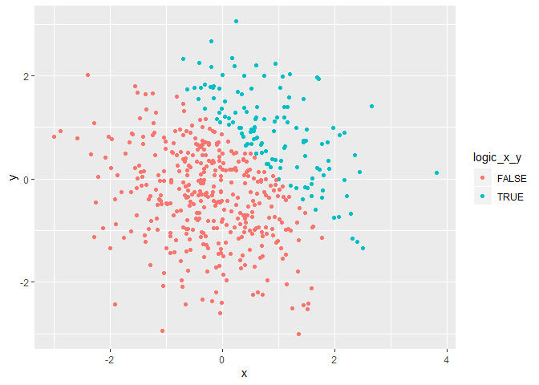
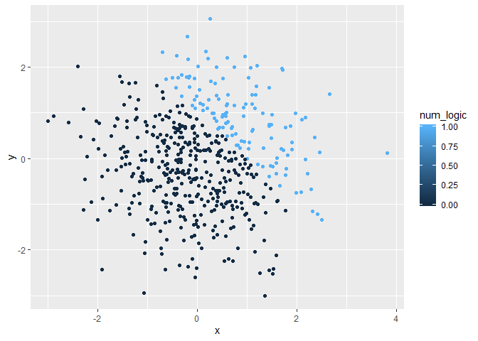
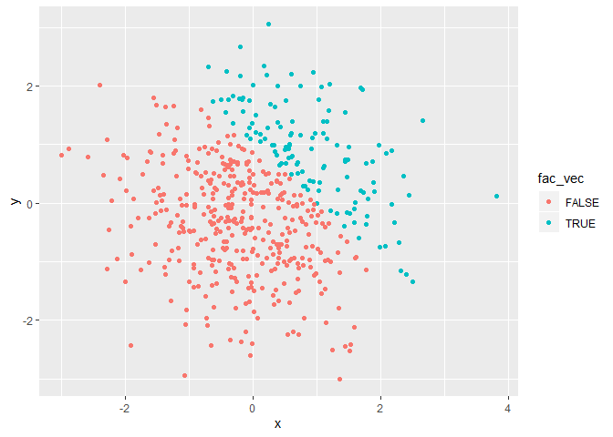

P8105 HW01
================

## Problem 1a

``` r
library(tidyverse)
```

    ## -- Attaching packages ------------------------------------------------------------------------ tidyverse 1.2.1 --

    ## v ggplot2 3.2.1     v purrr   0.3.2
    ## v tibble  2.1.3     v dplyr   0.8.3
    ## v tidyr   0.8.3     v stringr 1.4.0
    ## v readr   1.3.1     v forcats 0.4.0

    ## -- Conflicts --------------------------------------------------------------------------- tidyverse_conflicts() --
    ## x dplyr::filter() masks stats::filter()
    ## x dplyr::lag()    masks stats::lag()

``` r
set.seed(1)

hw1_df = tibble(
  ## creating a random sample of size 8 normally distributed
  rand_samp = rnorm(8), 
  
  ## is the random sample value greater than 0 in logic form
  samp_vec_gtr = rand_samp>0,  
  
  ## character vector with 8 elements
  char_vec = c("I","am","hoping","this","homework","structure","is","correct"), 
  
  ## factor vector of length 8 and 3 different levels
  fac_vec=factor(c("sam", "I", "am", "I", "am", "am", "I", "sam"))
  
)

mean(pull(hw1_df,rand_samp))
```

    ## [1] 0.1314544

``` r
mean(pull(hw1_df,samp_vec_gtr))
```

    ## [1] 0.625

``` r
mean(pull(hw1_df,char_vec))
```

    ## Warning in mean.default(pull(hw1_df, char_vec)): argument is not numeric or
    ## logical: returning NA

    ## [1] NA

``` r
mean(pull(hw1_df,fac_vec))
```

    ## Warning in mean.default(pull(hw1_df, fac_vec)): argument is not numeric or
    ## logical: returning NA

    ## [1] NA

**1a code responses:**

The mean function works for the random normal distribution sample and
the logic vector but not the character or factor vectors

### **Problem 1b**

``` r
as.numeric(pull(hw1_df,samp_vec_gtr))
as.numeric(pull(hw1_df,char_vec))
as.numeric(pull(hw1_df,fac_vec))
```

``` r
logic_vec_num=as.numeric(pull(hw1_df, samp_vec_gtr))
log_times_rand=(pull(hw1_df,rand_samp))*logic_vec_num

logic_factor=factor(logic_vec_num)
fac_times_rand=(pull(hw1_df,rand_samp))*logic_factor
```

    ## Warning in Ops.factor((pull(hw1_df, rand_samp)), logic_factor): '*' not
    ## meaningful for factors

``` r
logic_factor_num=(pull(hw1_df,rand_samp))*(as.numeric(logic_factor))
```

**Problem 1 Responses** Trying to return mean for the variables produces
values for the normal distribution and logic variable but not the
character or factor variables. When looking at these variables from the
as.numeric function, it makes sense. The distribution variables are
numbers and thus has a mean. The logic variable can be represented by
0/1 and will have a mean when using that method of indicating
true/false. The character variable does not have any number associated
with each element in the vector. Thus it will not have a mean. The
factor variable is the only odd one. It does have an as.numeric value
because each element returns their “level” as the numeric but since
these numbers are categories and not values, it does not return a mean
value.

## Problem 2

``` r
set.seed(1)

prob2_df=tibble(
  x=rnorm(500),
  y=rnorm(500),
  logic_x_y=(x+y)>1,
  num_logic=as.numeric(logic_x_y),
  fac_vec=factor(logic_x_y)
)
```

The data frame from problem 2 has a size of 500 rows and 5 columns.

The x variable has a mean of 0.0226441, median of 0.0226441, and a
standard deviation of 1.0119283.

X+Y was greated than 1 25.2percent.

``` r
ggplot(
  prob2_df, 
  aes(x = x, y = y,color=logic_x_y)) + geom_point()
```

<!-- -->

``` r
ggsave("firstggplot.jpeg")
```

    ## Saving 7 x 5 in image

``` r
ggplot(
  prob2_df, 
  aes(x = x, y = y,color=num_logic)) + geom_point()
```

<!-- -->

``` r
ggplot(
  prob2_df, 
  aes(x = x, y = y,color=fac_vec)) + geom_point()
```

<!-- -->
